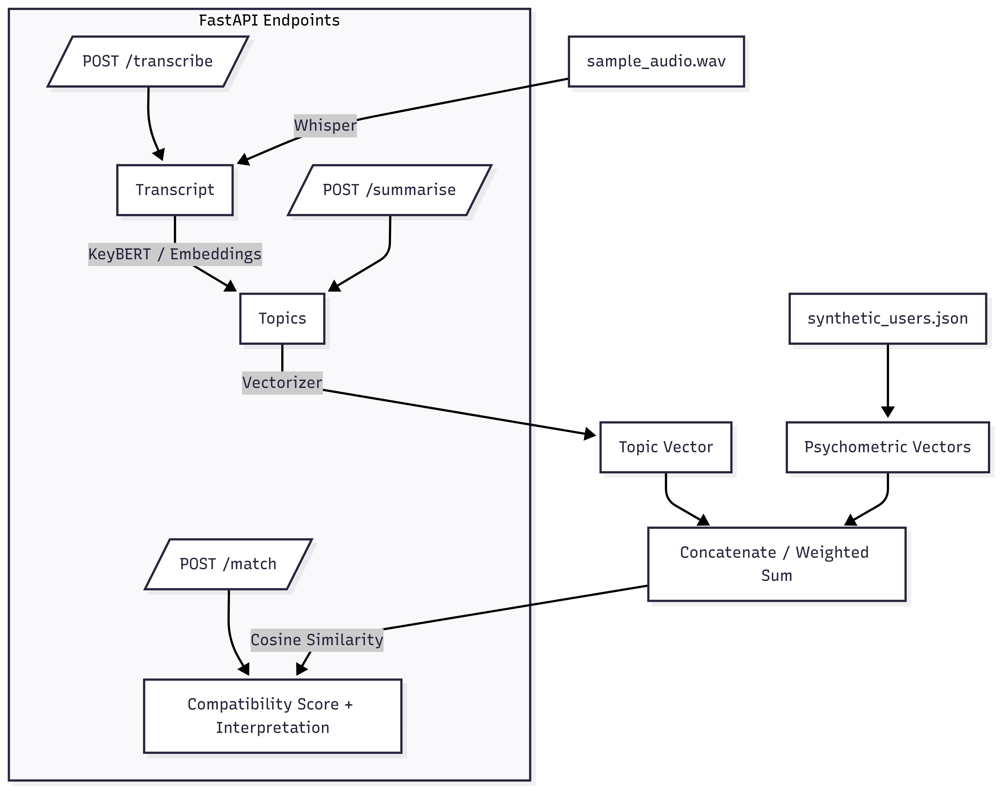

# ml-takehome

## Overview

**Current Focus**: Lightweight, CPU-friendly protoptye (Whisper-base, KeyBERT, TF-IDF) that provide good performance without requiring expensive hardware.

This project implements a mini AI/ML pipeline that:

1.	Transcribes speech from audio (Whisper).
2.	Extracts discussion topics (KeyBERT + embeddings).
3.	Generates intelligent summaries using topic-guided extractive summarization.
4.	Vectorizes topics and fuses them with psychometric profiles using weighted combination.
5.	Computes a compatibility score between two synthetic users.
6.	Exposes the pipeline via a FastAPI application with three endpoints:
	 - POST /transcribe - Transcribe audio to text
	 - POST /summarise - Extract topics and summarize text
	 - POST /match - Compute user compatibility with optional topic weighting



*The workflow diagram shows the complete data flow from audio input through transcription, topic extraction, vectorization, and user matching to produce compatibility scores.*

### My Development Workflow
1. **Experiments**: Jupyter notebooks for prototyping and analysis
2. **Service Development**: Modular Python services with clear interfaces
3. **API Integration**: FastAPI endpoints with comprehensive documentation
5. **Deployment**: Docker containerization for production readiness

## Project Structure
```markdown
ml_takehome/
├── app/                        
│   ├── main.py                  # FastAPI entrypoint
│   ├── routers/                 
│   │   ├── transcribe.py        # POST /transcribe
│   │   ├── summarise.py         # POST /summarise
│   │   └── match.py             # POST /match
│   ├── services/                
│   │   ├── transcription.py     # Whisper transcription
│   │   ├── topic_extraction.py  # KeyBERT / embeddings
│   │   ├── vectorization.py     # TF-IDF / embeddings / one-hot
│   │   ├── user_matching.py     # Cosine similarity + interpretation
│   └── utils/                   
│       ├── io_utils.py
│       ├── logger.py
│       └── config.py
│
├── sample_data/                 
│   ├── sample_audio.wav
│   └── synthetic_users.json
│
├── notebooks/                   # EDA & experiments
│   ├── transcription_demo.ipynb
│   ├── topic_extraction_demo.ipynb
│   └── matching_demo.ipynb
│
├── tests/                       
│   ├── test_transcription.py
│   ├── test_topic_extraction.py
│   ├── test_vectorization.py
│   └── test_user_matching.py
│
├── requirements.txt             
├── Dockerfile                   
├── README.md                    
└── writeup.md                   # ≤300 words: trade-offs & next steps
```

## Pipeline Overview

## Setup & Installation

### Option 1: Local Development

1. Clone this repo

```bash
git clone https://github.com/<your-username>/ml-takehome.git
cd ml-takehome
```

2. Create and activate virtual environment

```bash
python -m venv venv
source venv/bin/activate  # On Windows: venv\Scripts\activate
```

3. Install dependencies

```bash
pip install -r requirements.txt
python -m spacy download en_core_web_sm
```

4. Run FastAPI server

```bash
uvicorn app.main:app --reload --host 0.0.0.0 --port 8000
```

5. Access FastAPI Docs

```bash
http://localhost:8000/docs
```

### Option 2: Docker (Recommended for Production)

1. Install Docker Desktop
   - Download from: https://www.docker.com/products/docker-desktop/
   - Install and start Docker Desktop

2. Build the Docker image

```bash
docker build -t ml-takehome-api .
```

3. Run the container

```bash
# Run in foreground
docker run -p 8000:8000 ml-takehome-api

# Or run in background (detached)
docker run -d -p 8000:8000 --name ml-api ml-takehome-api
```

4. Access the API

```bash
# API Documentation
http://localhost:8000/docs

# Health check
http://localhost:8000/
```

5. Stop the container (if running in background)

```bash
docker stop ml-api
docker rm ml-api
```

## API Endpoints

### POST /transcribe
- **Input**: Audio file (wav, mp3, etc.)
- **Output**: Transcript text
- **Description**: Transcribes audio to text using Whisper

#### Transcribe Request Example:
```bash
upload audio_file
```


### POST /summarise
- **Input**: Transcript text
- **Output**: Extracted topics + intelligent summary
- **Description**: Extracts topics using KeyBERT and generates topic-guided summary

#### Summarise Request Example (response from POST/transcribe):
```json
{
  "transcript": "So let's let's take it past the point where you have these scales you have a reusable ship Yeah, and you've you've got it dialed in then what are the steps? What what's next step after that is it an unmanned Voyage to Mars..."
}
```


### POST /transcribe-summarise
- **Input**: Audio file (wav, mp3, etc.)
- **Output**: Transcript + topics + summary
- **Description**: Combined endpoint for complete audio processing pipeline

#### Transcribe-Summarise Request Example:
```bash
upload audio_file
```

#### Transcribe-Summarise Response Example:
```json
{
  "transcript": "So let's let's take it past the point where you have these scales...",
  "topics": ["starships", "terraforming", "scales", "plan", "synchronization"],
  "summary": "The discussion covers Mars mission planning, including reusable ships, orbital synchronization, and terraforming strategies."
}
```

### POST /topic-extraction-comparison
- **Input**: Transcript text + number of topics
- **Output**: Comparison of different topic extraction methods
- **Description**: Compare TF-IDF, spaCy, KeyBERT, DistilBERT+Clustering, and SentenceTransformer+Clustering

#### Topic Comparison Request Example:
```json
{
  "transcript": "So let's let's take it past the point where you have these scales...",
  "top_n": 5
}
```

#### Topic Comparison Response Example:
```json
{
  "results": [
    {
      "method": "TF-IDF",
      "topics": ["mars", "like", "time", "yeah", "just"],
      "time_sec": 0.004,
      "memory_mb": 0.2
    },
    {
      "method": "KeyBERT",
      "topics": ["mars", "ship", "scales", "synchronization", "hopefully"],
      "time_sec": 6.528,
      "memory_mb": 73.8
    }
  ],
  "summary": {
    "total_methods": 5,
    "fastest_method": "TF-IDF",
    "most_memory_efficient": "DistilBERT+Clustering"
  }
}
```

### GET /topic-extraction-comparison/methods
- **Input**: None
- **Output**: Available topic extraction methods with descriptions
- **Description**: Get information about all available topic extraction methods

### POST /match
- **Input**: Two user IDs + optional topics and weights
- **Output**: Compatibility score + interpretation
- **Description**: Computes user compatibility using weighted topic and psychometric vectors

#### Match Request Example (topics can be found in the response of POST/transcribe-summarise):
```json
{
  "user1_id": "user_1",
  "user2_id": "user_2",
  "topics": ["starships", "terraforming", "scales", "plan", "synchronization"],
  "topic_weight": 0.5,
  "psych_weight": 1.0
}
```

#### Match Response Example:
```json
{
  "score": 0.699,
  "interpretation": "Moderately compatible"
}
```

## Architecture & Design Decisions

### System Architecture

```
Audio Input → Transcription → Topic Extraction → Summarization
                    ↓
User Profiles → Vectorization → Compatibility Matching
```

### ML/AI Component Decisions

#### 1. **Transcription (Whisper)**
**Decision**: OpenAI Whisper with hybrid model selection
- **Model Choice**: `base` model for optimal balance of accuracy vs. resource usage
- **Rationale**: 
  - `tiny`: Too fast but poor accuracy for conversational speech
  - `base`: **Selected** - Good accuracy, reasonable memory (~1GB), ~3-5s processing time
  - `small/medium`: Better accuracy but significantly higher memory requirements
- **Device Support**: CPU/GPU fallback with automatic detection
- **Memory Optimization**: Model loading and cleanup to prevent memory leaks

#### 2. **Topic Extraction (KeyBERT)**
**Decision**: KeyBERT over TF-IDF, spaCy, and clustering methods
- **Method Comparison**:
  - **TF-IDF**: Fast (0.002s) but poor with conversational fillers ("like", "yeah", "just")
  - **spaCy**: Better filtering but still struggles with conversational speech
  - **KeyBERT**: **Selected** - Best semantic understanding, good balance of quality/resources
  - **DistilBERT + Clustering**: Good semantics but outputs sentences, not keywords
- **Model**: `all-MiniLM-L6-v2` for optimal performance
- **Features**: MMR (Maximal Marginal Relevance) to reduce redundant keywords
- **Output**: `['starships', 'terraforming', 'scales', 'plan', 'synchronization']`

#### 3. **Summarization (Advanced Conversational Processing)**
**Decision**: Single-sentence summarization with 6-factor scoring system over multi-sentence approach
- **Method Comparison**:
  - **Multi-sentence**: Struggles with conversational noise, requires post-processing
  - **Single-sentence**: **Selected** - Advanced preprocessing and scoring for conversational audio
- **Performance**: 79.5% length reduction while maintaining information quality
- **Advanced Scoring System**:
  - **Topic Relevance (40%)**: Prioritize sentences containing extracted topics
  - **Content Density (20%)**: Prefer substantial, meaningful content
  - **Position Weighting (25%)**: Focus on middle content (main discussion)
  - **Conversational Elements (10%)**: Bonus for questions and future statements
  - **Length Optimization**: Penalize too short (<30 chars) or too long (>300 chars)
  - **Quality Checks**: Avoid incomplete thoughts ending with conjunctions
- **Conversational Handling**:
  - **Filler Removal**: Automatically removes "yeah", "uh", "um", "like", "you know"
  - **Regex Splitting**: Better sentence detection for conversational speech
  - **Quality Filtering**: Only keeps substantial sentences (>15 chars)

#### 4. **Vector Fusion & Matching**
**Decision**: Weighted concatenation with comprehensive edge-case handling
- **Vectorization**: TF-IDF for topics (converts keywords to numerical vectors)
- **Weighting Strategy**:
  - **Topic Weight**: 0.5 - Users listening to same audio may have similar interests
  - **Psychometric Weight**: 1.0 - Personality is dominant factor in compatibility
- **Similarity**: Cosine similarity with enhanced interpretable thresholds
- **Compatibility Classes** (7 levels):
  - **0.9+**: Exceptionally compatible - Perfect match
  - **0.8+**: Highly compatible - Strong match
  - **0.7+**: Very compatible - Good match
  - **0.6+**: Moderately compatible - Decent match
  - **0.4+**: Somewhat compatible - Weak match
  - **0.2+**: Low compatibility - Poor match
  - **<0.2**: Very low compatibility - Minimal match

### Trade-offs & Considerations

#### **Accuracy vs. Performance**
- **Transcription**: Chose `base` model over `small/medium` for better resource efficiency
- **Topic Extraction**: KeyBERT over faster TF-IDF for better semantic understanding
- **Memory Usage**: Optimized for ~1-2GB RAM usage vs. 5GB+ for larger models

#### **Flexibility vs. Simplicity**
- **Weighted Matching**: Allows tuning of topic vs. psychometric importance
- **Optional Parameters**: Topics can be provided or auto-extracted
- **Modular Design**: Easy to swap components (e.g., different summarization methods)

#### **Real-world Applicability**
- **Conversational Speech**: Optimized for natural speech with fillers and pauses
- **Scalable Architecture**: Can handle multiple users and conversations
- **Production-Ready**: Comprehensive edge-case handling and error management

### Engineering Decisions

#### 1. **Modular Service Architecture**
- **Services**: `transcription.py`, `topic_extraction.py`, `user_matching.py`, `vectorization.py`
- **Routers**: Separate FastAPI routers for each endpoint
- **Utils**: Shared utilities for I/O, logging, configuration
- **Benefits**: Easy testing, maintenance, and feature addition

#### 2. **API Design Philosophy**
- **RESTful**: Clear HTTP methods and resource-based URLs
- **Comprehensive Models**: Pydantic models for request/response validation
- **Optional Parameters**: Flexible matching with optional topic weighting
- **Robust Error Handling**: 
  - **Input Validation**: User ID existence, weight limits, data format checks
  - **HTTP Status Codes**: Proper 400/500 error responses with detailed messages
  - **Graceful Degradation**: Fallbacks for missing data and edge cases
  - **Exception Management**: Comprehensive try-catch with meaningful error messages

#### 3. **Performance Optimizations**
- **Memory Management**: Process monitoring and cleanup in transcription
- **Model Caching**: Efficient model loading strategies
- **Resource Awareness**: CPU/GPU detection and fallback mechanisms
- **Docker Optimization**: Multi-stage builds and dependency caching

#### 4. **Deployment Strategy**
- **Docker**: Containerized for consistent deployment
- **Dependencies**: FFmpeg for audio processing, optimized Python packages
- **Portability**: Works across different environments and cloud platforms
- **Scalability**: Stateless design allows horizontal scaling

## Next Steps & Improvements

The following components are currently stubbed out and ready for implementation:

**LLM Fine Tuning & Orchestration**
  - **GPT-2/LLaMA Fine Tuning**: Custom models for domain-specific summarization and matching
  - **LangChain Integration**: Advanced LLM orchestration and chaining
  - **OpenAI API**: GPT models for enhanced text understanding and generation

	**Note**: These advanced features are not implemented in the current version due to hardware constraints (limited GPU memory and compute resources). The current implementation focuses on CPU-optimized, lightweight models for accessibility.

**Configuration Management** (`app/utils/config.py`)
  - Environment-based configuration (dev/staging/prod)
  - Model parameter configuration (Whisper model size, KeyBERT settings)

**Logging System** (`app/utils/logger.py`)
  - Centralized logging configuration
  - Request/response logging for API endpoints
  - Performance metrics logging / Error tracking

**Comprehensive Test Suite** (`tests/`)
  - `test_transcription.py`: Audio file validation, model loading, error handling
  - `test_topic_extraction.py`: KeyBERT functionality, summary generation, edge cases
  - `test_user_matching.py`: Compatibility scoring, vector fusion, boundary conditions, edge cases
  - `test_vectorization.py`: TF-IDF vectorization, psychometric processing

**Load Balancing**: Handle multiple concurrent requests
**Database Integration**: User profiles, conversation history
**CI/CD**

## Creative Extensions

### **Enhanced API Endpoints**

#### **Combined Transcribe & Summarise** (`/transcribe-summarise`)
- **Purpose**: Single API call for complete audio processing pipeline
- **Input**: Audio file (WAV, MP3, etc.)
- **Output**: Transcript, extracted topics, and intelligent summary
- **Benefits**: 
  - Reduces API calls from 2 to 1
  - Maintains topic consistency between extraction and summarization
  - Better user experience for complete audio analysis

#### **Topic Extraction Comparison** (`/topic-extraction-comparison`)
- **Purpose**: Compare different topic extraction methods on the same transcript
- **Methods**: TF-IDF, spaCy, KeyBERT, DistilBERT+Clustering, SentenceTransformer+Clustering
- **Features**:
  - Performance metrics (time, memory usage)
  - Side-by-side topic quality comparison
  - Method recommendations based on use case
- **Benefits**:
  - Research and experimentation tool
  - Method selection guidance
  - Performance benchmarking

#### **Method Information** (`/topic-extraction-comparison/methods`)
- **Purpose**: Get detailed information about available topic extraction methods
- **Output**: Method descriptions, pros/cons, use case recommendations
- **Benefits**: API documentation and method selection guidance
